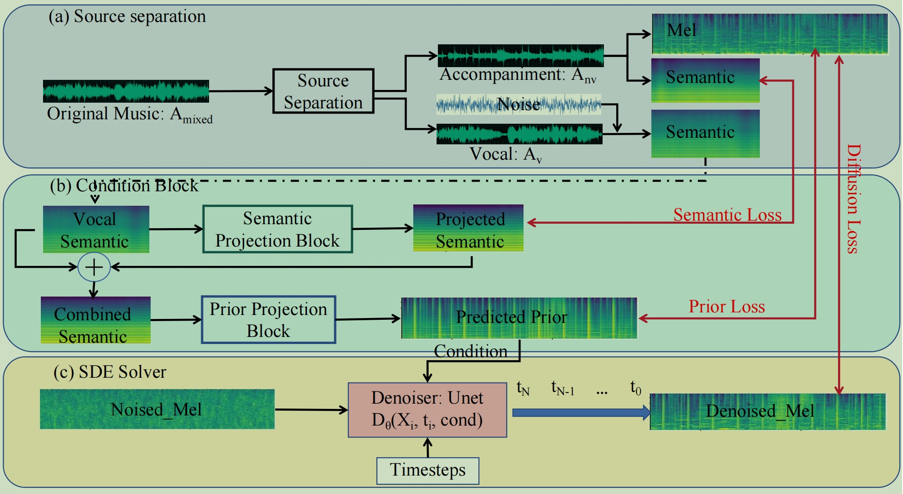

# fastsag

This is a PyTorch/GPU implementation of the IJCAI 2024 paper [FastSAG: Towards Fast Non-Autoregressive Singing Accompaniment Generation](https://www.ijcai.org/proceedings/2024/0843.pdf).
Demo page can be found at [demo](https://fastsag.github.io/).

<p align="center">
  
</p>

```
@article{chen2024fastsag,
  title={FastSAG: Towards Fast Non-Autoregressive Singing Accompaniment Generation},
  author={Chen, Jianyi and Xue, Wei and Tan, Xu and Ye, Zhen and Liu, Qifeng and Guo, Yike},
  journal={arXiv preprint arXiv:2405.07682},
  year={2024}
}
```
### Preparation
1. Download this code:

```
git clone https://github.com/chenjianyi/fastsag/
cd fastsag
```

2. Download fastsag checkpoint from [here](https://hkustconnect-my.sharepoint.com/:f:/g/personal/jchenil_connect_ust_hk/EjM0CpbBGC9NsEMI9iLFyVQBC3A9tDInoG-EGmDciRQqyQ?e=rqfidw)
   and put all weights in fastsag/weights

   BigvGAN checkpoints could be downloaded from [BigvGAN](https://github.com/NVIDIA/BigVGAN). The checkpoints we used is "bigvgan_24khz_100band".

   [MERT](https://huggingface.co/papers/2306.00107) pretrained checkpoints would be downloaded automatically from huggingface. Please make sure your sever could access huggingface.

### Dataset

1. Source seperation:

```
cd preprocessing
python3 demucs_processing.py  # you may need to change root_dir and out_dir in this file
```
2. cliping to 10s and filtering salient clips
```
python3 clip_to_10s.py  # change src_root and des_root for your dataset
```

### Training
```
cd ../sde_diffusion
python3 train.py --data_dir YOUR_TRAIN_DATA --data_dir_testset YOUR_TEST_DATA --results_folder RESULTS
```

### Generation
```
python3 generate.py --ckpt TRAINED_MODEL --data_dir DATA_DIR --result_dir OUTPUT
```

### Acknowledgement and reference
1. [Grad-TTS](https://github.com/huawei-noah/Speech-Backbones/blob/main/Grad-TTS/).
2. [CoMoSpeech](https://github.com/zhenye234/CoMoSpeech)
